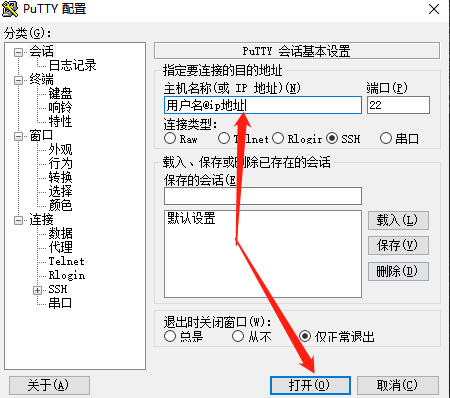

# Linux
## 为什么要远程连接Linux
    我们之前有讲过Linux是一个多用户、多任务的操作做系统;且Linux 一般作为服务器使用，而服务器一般放在机房，你不可能在机房操作你的 Linux 服务器。
    这时我们就需要远程登录到Linux服务器来管理维护系统。
## 用什么协议远程连接,以及能够保障连接的安全性?-SSH(安全外壳协议)
    SSH 为 Secure Shell 的缩写，由 IETF 的网络小组（Network Working Group）所制定；SSH 为建立在应用层基础上的安全协议。SSH 是较可靠，专为远程登录会话和其他网络服务提供安全性的协议。利用 SSH 协议可以有效防止远程管理过程中的信息泄露问题。SSH最初是UNIX系统上的一个程序，后来又迅速扩展到其他操作平台。SSH在正确使用时可弥补网络中的漏洞。SSH客户端适用于多种平台。几乎所有UNIX平台—包括HP-UX、Linux、AIX、Solaris、Digital UNIX、Irix，以及其他平台，都可运行SSH。
## ssh端口 一般默认22
    Linux 系统中是通过 ssh 服务实现的远程登录功能，默认 ssh 服务端口号为 22。
## 实战
### 采用最轻便的putty来演示
    
```
#主机名称 以用户名 + @ + ip地址 (下面地址是我瞎写的,不承担任何法律责任)
wodeyonghuming@110.110.12.14
#然后会出现,password,直接输入密码,这里为了保护你的密码,不显示输入过程,输完按下回车即可.
```

