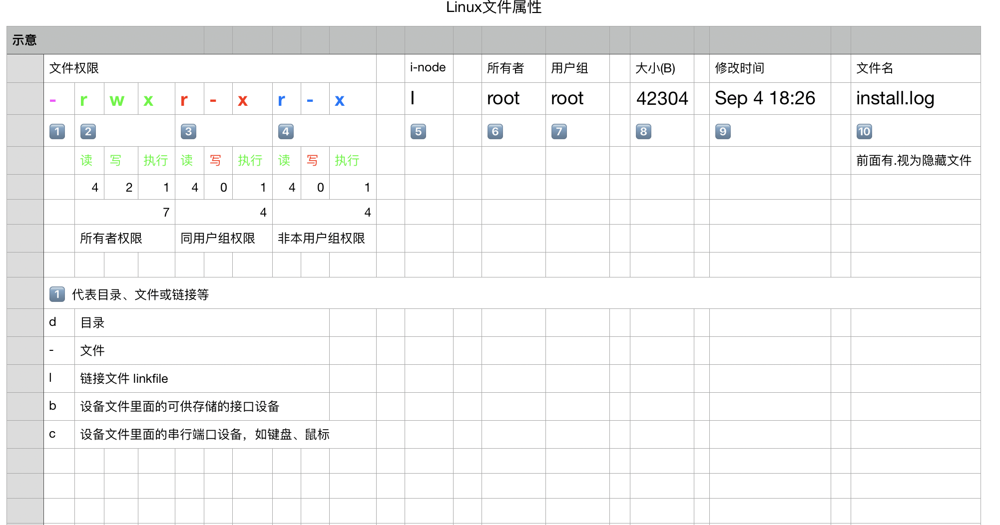

# Linux -> basic
# linux 文件权限属性
请看下面Excel的解释

    


###设置目录和文件的权限
```
通过chmod命令设置文件或目录的权限，可以采用两种形式的权限表示方法：字符形式和数字形式。r、w、x权限字符可分别表示为八进制数字4、2、1，表示一个权限组合时需要将数字进行累加。
使用chown命令为文件或目录设置归属
如：“rwx”采用累加数字形式可表示为“7”，“r-x”可表示为“5”，而“rwxr-xr-x”由三个权限段组成，因此可以表示成“755”
chmod 777 -R aaa
chmod +x -R aaa

u:所有者(user)  g:所有组(group)  o:其他人(other)  a:所有人(u、g、o的总和)(all)  
 
1) chmod   u=rwx,g=rx,o=x     文件、目录 【表示：给所有者rwx, 给所在组的用户 rx, 给其他人 x】  
 
2) chmod   o+w                文件、目录 【表示：给其它用户增加w 的权限】  
 
3) chmod   a-x                文件、目录    【表示：给所有用户 去掉 x权限】
```

###设置目录和文件的归属
```
命令格式：

chown 属主 文件或目录

chown :属组 文件或目录

chown 属主:属组 文件或目录

注：同时设置属主、属组时，用户名和组名之间用冒号“：”进行分隔。如果只设置属组时，需使用“：组名”的形式。

常用选项：

-R：递归修改指定目录下所有文件、子目录的归属

```